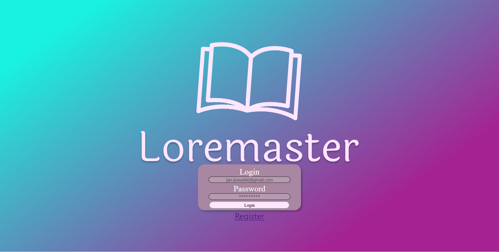
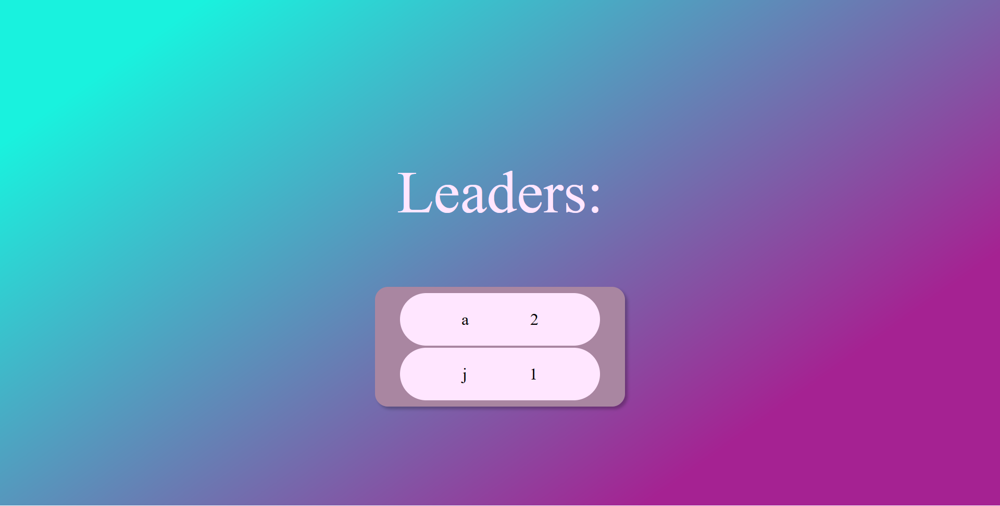
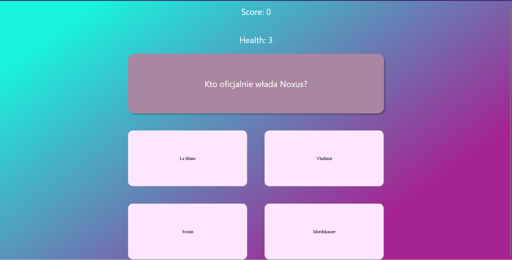

# Loremaster
> A fanmade quiz of League of Legends lore

## Table of contents
[About Loremaster](#about-loremaster)

[Technologies used](#technologies-used)

[Features](#features)

[Screens](#screens)
## About Loremaster
Loremaster is a website wich tests your knowledge of Runeterras world. 
You can test your knowledge and compare yourself to other players in the leaderboard.

## Technologies used
### Front end
- React.js
- CSS

### Backend
- Spring boot

### Other

- postgreSQL
- Docker
- Git

## Features

- the user can choose the region of the test(currently only Runeterra, Demacia and Noxus are aviable)
- the users highscore is saved in the database wich allows them to see how they fare against other users

## Screens

